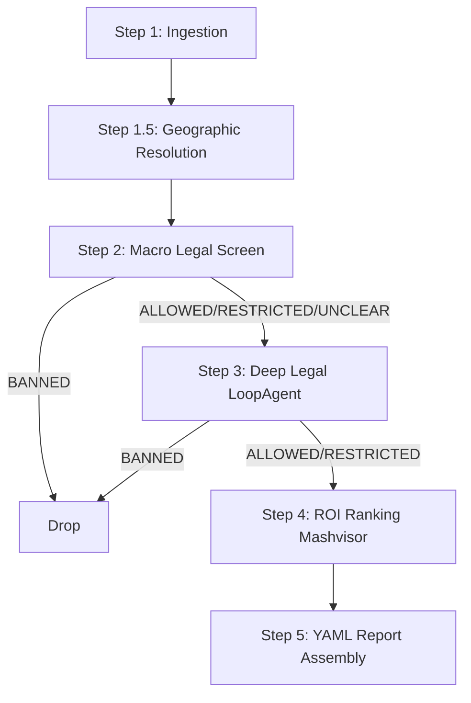

# STR Agentic EDD Plan

## Phase 1: Establish the Evaluation Baseline (EDD)
*   **Update `tests/eval/datasets/basic-dataset.json`**: Ensure comprehensive coverage of real-world STR zoning scenarios to rigorously test the `DeepLegalLoopAgent`:
    *   **Fully Banned**: New York City, NY (Local Law 18).
    *   **Primary Residence Only**: Los Angeles, CA.
    *   **Permit Caps & Lotteries**: San Diego, CA (Tier system & caps).
    *   **Zoning Overlays & Commercial-Only**: Austin, TX.
    *   **Minimum-Stay Requirements**: Honolulu, HI (30-day/90-day minimums depending on zone).
    *   **Unique Structure Restrictions**: Jurisdictions that allow STRs but explicitly ban "temporary structures" (e.g., Yurts, RVs, Tiny Homes on wheels).
    *   **Jurisdictional Nuance (City vs. Unincorporated County)**: Las Vegas city limits vs. unincorporated Clark County.
    *   **STR-Friendly (Control Cases)**: Gatlinburg, TN.
*   **Update `tests/eval/eval_config.yaml`**:
    *   Create `custom_response_quality` to enforce the output format perfectly matches `specs/final_report_template.yaml`.
    *   Create a custom metric for Step 2 to ensure accurate classification (Banned vs. Allowed/Restricted) from search snippets, minimizing false positives that would drop viable markets.
    *   Create a custom metric (e.g., `micro_trajectory_adherence`) that grades the `{agent_data}` trace strictly for the Step 3 `LoopAgent` to ensure it:
        1. Actually uses `fetch_page` to read zoning codes instead of guessing from search snippets.
        2. Prioritizes scraping official sources (`.gov`, `municode.com`, `ecode360.com`) over random blogs.
        3. Correctly identifies the *specific* restriction type (e.g., primary residence vs. permit cap).
        4. Does not get stuck in infinite scraping loops.
    *   *Note: Macro-pipeline trajectory (e.g., calling Mashvisor and Geographic APIs) will be verified via deterministic `pytest` unit/integration tests, not LLM-as-judge.*

## Phase 2: Backend Integrations & Agent Tools
*   **LLM Tools (`app/tools.py`)**: Finish `serper_search` and `fetch_page`. These will be passed explicitly to the `LoopAgent` for deep legal research.
*   **Backend API Clients (`app/integrations.py`)**:
    *   **Geocoding**: Implement `geocode_location` using the Google Maps Geocoding API and Overpass API to resolve ZIP codes and regions to municipalities efficiently and scalably.
    *   **Mashvisor**: Finish `mashvisor_lookup` and `mashvisor_historical`, normalizing the outputs to match the schema expected by the report. Note: These are called deterministically by the pipeline script and are NOT exposed to the LLMs to prevent unprompted API usage.

## Phase 3: Agent & Pipeline Logic (The Funnel)
Implement the deterministic 5-step pipeline architecture as outlined in `specs/Real Estate Assistant Design Doc.md`.

*   **Implement Step 3 (Deep Legal Verification)**: Build the `LoopAgent` inside `app/llm.py` that repeatedly queries `serper_search` and scrapes pages to fill out the `LegalStatus` JSON schema.
*   **Orchestration**: Wire Steps 1-5 together inside `run_pipeline` (`app/pipeline.py`) so `StrReportAgent` simply triggers the funnel and returns the report.
*   **API Cost Controls**: Implement a call counter in `app/pipeline.py` that enforces the maximum limits defined in `app/api_limits.py`. Agentic loop APIs (Serper, fetch, loop-LLM) use static backstop limits; deterministic APIs (geocoding, Mashvisor, single-shot LLM) scale with input size. Per-municipality legal failures degrade to `undetermined_municipalities` rather than aborting the whole request. LLM tiering: `gemini-3.1-flash-lite` for parse/macro/synthesis and the research executor; `gemini-3.5-flash` for the research evaluator and structured legal extraction.

## Architecture & Logic Breakdown

The architecture is a **hybrid** approach combining deterministic scripting with targeted agentic reasoning. This ensures mathematical accuracy while handling the unstructured nature of legal research.

### 1. Orchestrator Script (`app/pipeline.py`)
*   The overarching 5-step funnel is a highly deterministic Python script (`run_pipeline`).
*   **Why a script?** We do not want an LLM deciding *when* to check Mashvisor or *how* to calculate ROI.

### 2. The Root Agent (`app/agent.py`)
*   **Agent**: `StrReportAgent` (inherits from `BaseAgent`).
*   **Role**: Serves as the standard entry point. It takes the user's natural language prompt, passes it to the deterministic `run_pipeline()`, and returns the final YAML report. Implementing this as an `Agent` class ensures compatibility with the ADK for evaluation (`agents-cli eval`) and deployment.

### 3. Classification LLM (`app/llm.py`)
This is not a full agent, but a single-shot structured LLM call via the `google-genai` SDK. For Step 2, the LLM classifies text snippets (Banned vs. Allowed) using strict JSON schemas.

### 4. Deep Legal Researcher (`app/llm.py`)
*   **Agent**: `DeepLegalLoopAgent` (an ADK `LoopAgent`).
*   **Role**: Handles Step 3 (Deep Legal Verification).
*   **Why an Agent?** Finding zoning laws is an unstructured problem. A static script cannot reliably navigate a town's website vs a third-party portal like `municode.com`.
*   **How `LoopAgent` works**: The ADK `LoopAgent` automates the "ReAct" (Reasoning + Acting) loop. It prompts the LLM, parses the LLM's requests to use tools, executes the Python tools, feeds the results back, and repeats until the LLM can output the final `LegalStatus` JSON schema.
*   **Tools**: We explicitly pass `serper_search` (to find URLs and snippets) and `fetch_page` (to download and read the full text of zoning laws) to the `LoopAgent` upon initialization.

### 5. Report Assembly & Synthesis (`app/pipeline.py` & `app/llm.py`)
*   **Role**: Handles Step 5 (Synthesis & Deterministic Report Assembly).
*   **Deterministic Computation (Python)**: The orchestrator script computes all numeric/boolean fields (`municipal_str_score`, `annual_revenue_estimate`, `data_quality`, etc.) directly from Mashvisor data to avoid math hallucinations. It also ranks the final shortlist of markets.
*   **Synthesis (LLM)**: A fast single-shot LLM call generates a 2-3 sentence `qualitative_synthesis` grounded *only* on the deterministically calculated data.
*   **Assembly**: The final output is validated against Pydantic models matching `specs/final_report_template.yaml` and serialized to YAML.

## Phase 4: Testing & The Quality Flywheel

### Hybrid Testing Strategy
Because the architecture combines agentic reasoning with deterministic scripting, testing must be handled via a hybrid approach:
1.  **Agentic Tools (Live Web)**: During `agents-cli eval generate`, tools like `serper_search` and `fetch_page` MUST hit the live internet. This ensures the `LoopAgent` is evaluated on its ability to navigate messy, unstructured, real-world data (404s, popups, bad formatting) rather than a clean sandbox.
2.  **Deterministic Paid APIs (Sandboxed)**: Expensive, highly structured data APIs (Mashvisor, Google Maps Geocoding) are called deterministically by the pipeline. To save money and avoid rate limits during agent eval and unit testing, these calls MUST be mocked or recorded/replayed using `vcrpy` (intercepting the HTTP requests to return local JSON cassettes).

*   **Unit & Integration Testing:** Use `pytest` alongside `vcrpy` to test the deterministic macro-pipeline (Steps 1, 2, 4, 5) without incurring API costs.
*   **Agent Evaluation:** Run `agents-cli eval generate` and `agents-cli eval grade` to generate traces and grade the LLM calls against the baseline established in Phase 1. Focus on structured output accuracy and the `LoopAgent`'s micro-trajectory.
*   **Optimize:** Perform code and prompt optimization (`agents-cli eval compare`) until the custom response quality and micro-trajectory metrics pass consistently.
