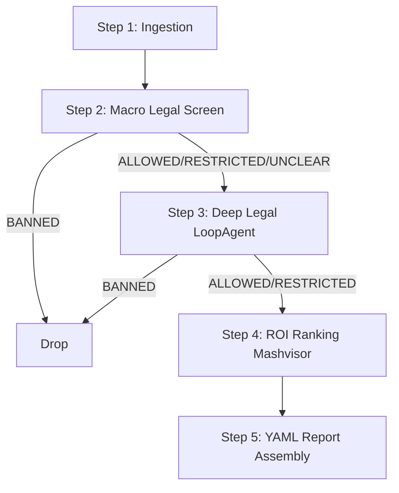

# STR Agentic EDD Plan

## Phase 1: Establish the Evaluation Baseline (EDD)
*   **Update `tests/eval/datasets/basic-dataset.json`**:
    *   Add diverse test cases: known STR-friendly areas, known STR-banned areas, and known STR-restricted areas like areas with strict minimum-stay rules.
*   **Update `tests/eval/eval_config.yaml`**:
    *   Create `custom_response_quality` to enforce the output format perfectly matches `specs/final_report_template.yaml`.
    *   Create custom metric for Step 2 to ensure accurate classification from search snippets.
    *   Create a new custom metric (e.g., `micro_trajectory_adherence`) that grades the `{agent_data}` trace strictly for the Step 3 `LoopAgent` to ensure it:
        1. Actually uses `fetch_page` to read zoning codes instead of guessing from search snippets.
        2. Prioritizes scraping official sources (`.gov`, `municode.com`) over random blogs.
        3. Does not get stuck in infinite scraping loops.
    *   *Note: Macro-pipeline trajectory (e.g., calling Mashvisor and Geographic APIs) will be verified via deterministic `pytest` unit/integration tests, not LLM-as-judge.*

## Phase 2: Tool Implementation
*   **Web Search Tools**: Finish `serper_search` and `fetch_page` in `app/tools.py`.
*   **Geocoding Tool**: Implement `geocode_location` in `app/tools.py` using a free/cheap API (like Nominatim) to resolve ZIP codes and regions to municipalities.
*   **Mashvisor Tools**: Finish `mashvisor_lookup` and `mashvisor_historical` in `app/tools.py`, normalizing the outputs to match the schema expected by the report.

## Phase 3: Agent & Pipeline Logic (The Funnel)
Implement the deterministic 5-step pipeline architecture as outlined in `specs/Real Estate Assistant Design Doc.md`.

*   **Implement Step 3 (Deep Legal Verification)**: Build the `LoopAgent` inside `app/llm.py` that repeatedly queries `serper_search` and scrapes pages to fill out the `LegalStatus` JSON schema.
*   **Orchestration**: Wire Steps 1-5 together inside `run_pipeline` (`app/pipeline.py`) so `StrReportAgent` simply triggers the funnel and returns the report.

## Architecture & Logic Breakdown
    
The architecture is a **hybrid** approach combining deterministic scripting with targeted agentic reasoning. This ensures mathematical accuracy while handling the unstructured nature of legal research.

### 1. Orchestrator Script (`app/pipeline.py`)
*   The overarching 5-step funnel is a highly deterministic Python script (`run_pipeline`).
*   **Why a script?** We do not want an LLM deciding *when* to check Mashvisor or *how* to calculate ROI. Mathematical calculations and control flow are hardcoded in Python to prevent hallucinations and wasted API calls.

### 2. The Root Agent (`app/agent.py`)
*   **Agent**: `StrReportAgent` (inherits from `BaseAgent`).
*   **Role**: Serves as the standard entry point. It takes the user's natural language prompt, passes it to the deterministic `run_pipeline()`, and returns the final YAML report. Implementing this as an `Agent` class ensures compatibility with the ADK for evaluation (`agents-cli eval`) and deployment.

### 3. Entity & Classification LLMs (`app/llm.py`)
*   **Role**: Handles Step 1 (Resolution) and Step 2 (Triage).
*   **Logic**: These are not full agents, but single-shot structured LLM calls via the `google-genai` SDK. For Step 1, the script will use the `geocode_location` tool (or pass it to the LLM) to accurately convert broad areas like "Poconos" or ZIP codes to specific municipalities. For Step 2, the LLM classifies text snippets (Banned vs. Allowed) using strict JSON schemas.

### 4. Deep Legal Researcher (`app/llm.py`)
*   **Agent**: `DeepLegalLoopAgent` (an ADK `LoopAgent`).
*   **Role**: Handles Step 3 (Deep Legal Verification).
*   **Why an Agent?** Finding zoning laws is an unstructured problem. A static script cannot reliably navigate a town's website vs a third-party portal like `municode.com`.
*   **How `LoopAgent` works**: The ADK `LoopAgent` automates the "ReAct" (Reasoning + Acting) loop. It prompts the LLM, parses the LLM's requests to use tools, executes the Python tools, feeds the results back, and repeats until the LLM can output the final `LegalStatus` JSON schema.
*   **Tools**: We explicitly pass `serper_search` (to find URLs and snippets) and `fetch_page` (to download and read the full text of zoning laws) to the `LoopAgent` upon initialization.

## Phase 4: Testing & The Quality Flywheel
*   **Unit & Integration Testing:** Run `uv run pytest tests/unit tests/integration` to verify the deterministic `app/pipeline.py` orchestrator correctly routes data, drops municipalities based on the rules (early bans), and never calls expensive APIs out of order.
*   **Agent Evaluation:** Run `agents-cli eval generate` and `agents-cli eval grade` to generate traces and grade the LLM calls against the baseline established in Phase 1. Focus on structured output accuracy and the `LoopAgent`'s micro-trajectory.
*   **Optimize:** Perform code and prompt optimization (`agents-cli eval compare`) until the custom response quality and micro-trajectory metrics pass consistently.